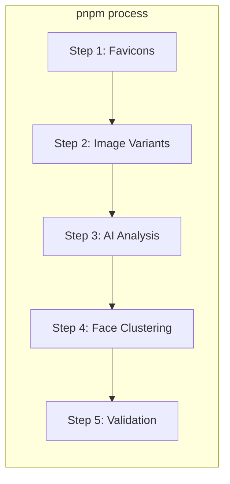
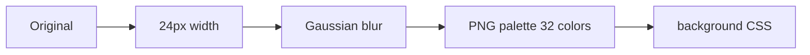
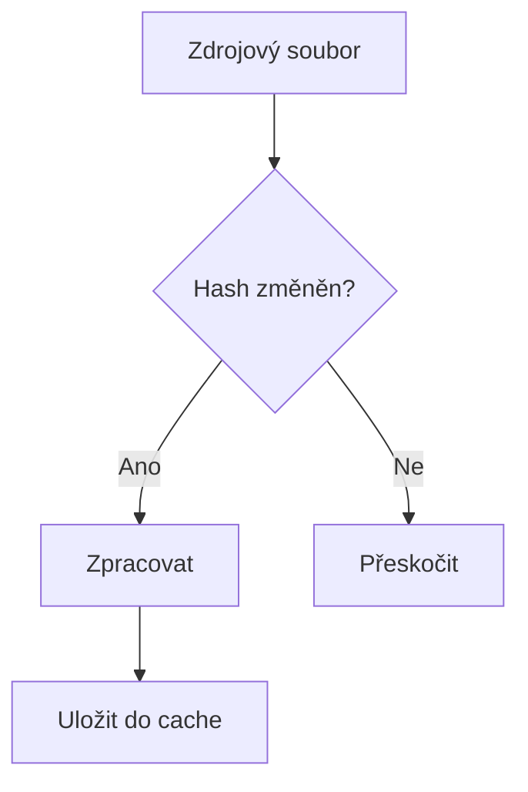

# Build proces

> Skripty, image pipeline a build workflow.

**Navigace:** [← INDEX](./INDEX.md) | [ARCHITECTURE →](./ARCHITECTURE.md) | [SCRIPTS →](./SCRIPTS.md)

## Obsah

1. [Pipeline přehled](#1-pipeline-přehled)
2. [Image processing](#2-image-processing)
3. [Build kroky](#3-build-kroky)
4. [Optimalizace](#4-optimalizace)

## 1. Pipeline přehled



### Příkazy

| Příkaz         | Účel                          |
| -------------- | ----------------------------- |
| `pnpm process` | Kompletní pipeline            |
| `pnpm dev`     | Dev server (`--manifestOnly`) |
| `pnpm build`   | Production build              |

## 2. Image processing

### Varianty

| Varianta      | Rozměr        | Použití             | Poznámka                                      |
| ------------- | ------------- | ------------------- | --------------------------------------------- |
| `default`     | 370×247 crop  | Grid mobile/desktop | Max-width: 575px, 1400px+                     |
| `xl`          | 534×356 crop  | Grid tablet         | 576px - 1399px                                |
| `detail`      | 1280px height | Lightbox            | Height-based (width fluid)                    |
| `pano_detail` | 1280px height | Panoramata          | **Height-based** (fit inside), width zachován |
| `admin_thumb` | 534×534 fit   | Admin UI            | Scaled inside (bez crop)                      |
| `fallback`    | 190×127 crop  | Miniatura           | Fallback                                      |
| `placeholder` | 24px blur     | LQIP                | Low-Quality Image Placeholder                 |

**Velikosti (detail variants):**

- `detail`: Standardní obrazky → Height 1280px, width fluid (aspect ratio preserved)
- `pano_detail`: Panoramata → Height 1280px, fit inside (nikdy crop)

### Formáty

| Formát | Kvalita | Komprese            | Podpora            |
| ------ | ------- | ------------------- | ------------------ |
| AVIF   | 50      | ~50% menší než JPEG | Moderní prohlížeče |
| WebP   | 65      | ~30% menší než JPEG | Široká podpora     |
| JPEG   | 80      | Baseline            | Fallback           |

**Encoding:**

```ts
jpeg: { progressive: true, chromaSubsampling: "4:2:0" }
webp: { effort: 4 }
avif: { effort: 5, chromaSubsampling: "4:2:0" }
```

### CLAP Processing (HEIC)

HEIC/HEIF soubory mohou obsahovat **Clean Aperture** (CLAP) atom - native crop metadata.

```ts
// build:
1. Extractujeme CLAP z HEIC container
2. Transformujeme z native (sensor coords) → user-space (post-EXIF rotation)
3. Uložíme do ImageEntry.clap: { width, height, horizOffset, vertOffset }
4. Při image resize: aplikujeme CLAP ořez před scale
```

**Side effects:**

- Detail variant generován s CLAP ořezem
- Web UI pak má možnost editovat CLAP v ClapEditor
- ExifTool zapisuje zpět CLAP atom do originálního HEIC

## 3. Build kroky

### Step 0: Separators (Markdown parsing)

```
Vstup:  content/<gallery>/locations/*.md
Výstup: Separators zahrnuty v pics.manifest.json
```

**Zpracování:**

1. Parsujeme YAML frontmatter:

   ```yaml
   title: Nazareth
   startDate: 2022-10-20T10:00:00
   endDate: 2022-10-20T17:00:00
   storyImageId: IMG_001
   ```

2. Matchujeme fotky v čase (EXIF date mezi startDate-endDate)

3. Thresholdy:
   ```
   minPhotosForAutoSeparator: 3  (auto-generation threshold)
   minPhotosForDisplay: 3        (display threshold)
   ```

**Auto-generation:** Pokud se nachází 3+ fotek na stejné lokaci (EXIF GPS), automaticky se vytvoří separator (bez markdown).

---

### Step 1: Favicons

```
Vstup:  content/<gallery>/favicons-source.png
Výstup: static-<gallery>/assets/favicons/
```

### Step 2: Image Variants

```
Vstup:  content/<gallery>/pics/*.{jpg,heic,png}
Výstup: static-<gallery>/images/
```

**Zpracování:**

1. **CLAP extraction** (pokud HEIC)
   - Extrahuj CLAP atom z container
   - Transformuj z native → user-space coords

2. **EXIF parsing**
   - Date, location, make/model (Pure Wall Clock)
   - ReleaseDate (pokud existuje)

3. **Resize → varianty** (podle config)
   - Default, XL, detail, pano_detail
   - Height-based pro detail (aspect ratio preserved)

4. **LQIP → 24px blur**
   - Low-quality placeholder

5. **Encode → AVIF/WebP/JPEG**
   - s configovanými quality settings

6. **Face detection** → bounding boxy (pro smart crop)

### Step 3: AI Analysis

```
Vstup:  Detail JPEG varianty
Výstup: analysis.manifest.json, embeddings.manifest.json
```

**Zpracování:**

1. CLIP embeddings (768D vektory)
2. Aesthetic score
3. Quality bucket (excellent/good/poor)
4. Detekce duplikátů

### Step 4: Face Clustering

```
Vstup:  Detail JPEG varianty
Výstup: people.manifest.json, faces.manifest.json
```

**Zpracování:**

1. Face detection (face-api.js)
2. 128D face embeddings
3. Euclidean distance clustering
4. Face crops → `static-<gallery>/faces/`

### Step 5: Sequences Detection

```
Vstup:  pics.manifest.json s EXIF daty
Výstup: sequenceInfo zahrnut v ImageEntry
```

**Zpracování:**

1. Group fotky podle EXIF location (GPS)
2. Detekuj 10-minute windows v čase
3. Přiřad representanta (first photo)
4. Všichni členové = reprezentanta PhotoDay

### Step 6: Validation

- Odstranění ghost záznamů
- Cleanup orphaned assets
- Vyčištění manifestů
- Validace sekvencí

## 4. Optimalizace

### Collage Reclassification

Během build se fotos automaticky klasifikují podle typu:

```ts
// Collage detection:
if (fileName.includes("--collage")) {
  // → category: "collage"
  // Zdrojové fotky označeny: category: "collage-source" (skryté)
}
```

**Collage inheritance:**

- `people` tagy dědí od všech zdrojů (union)
- `releaseDate` dědí od reprezentanta (first source image)

### LQIP (Low-Quality Image Placeholder)



### Sharp nastavení

```typescript
{
  palette: true,
  colors: 32,
  quality: 50,
  compressionLevel: 9
}
```

### Cache



---

## 5. Configuration Reference

### Separators Config

```ts
separator: {
  minPhotosForAutoSeparator: 3,  // Auto-gen threshold
  minPhotosForDisplay: 3,         // Display threshold
}
```

### Image Resize (Height-based)

```ts
detail: {
  kind: "other",
  resize: { height: 1280 },  // ← Height-limited
  format: ImageFormat.JPEG,
  folderName: "details",
}
```

Všechny detail varianty jsou **height-based**, width se zachovává (aspect ratio).

### Blur Config

```ts
blur: {
  enable: false,
  width: 24,
  colors: 32,
  pngCompression: 9,
  pngQuality: 50,
}
```

---

## 6. Performance Tuning

### Concurrency

```ts
script: {
  concurrency: "auto",  // CPU cores
  limit: 0,            // No limit
}
```

### Face Crop

```ts
cropFaceCenterRatio: 0.4,  // Center 40% of face
cropFaceZoom: 1.4,         // 40% zoom-in on face
```

## Související dokumenty

- [ARCHITECTURE.md](./ARCHITECTURE.md) — Hlavní přehled
- [SCRIPTS.md](./SCRIPTS.md) — CLI reference
- [ARCH-DATA-FLOW.md](./ARCH-DATA-FLOW.md) — Datové toky

---

_Poslední aktualizace: 2026-01-05_
