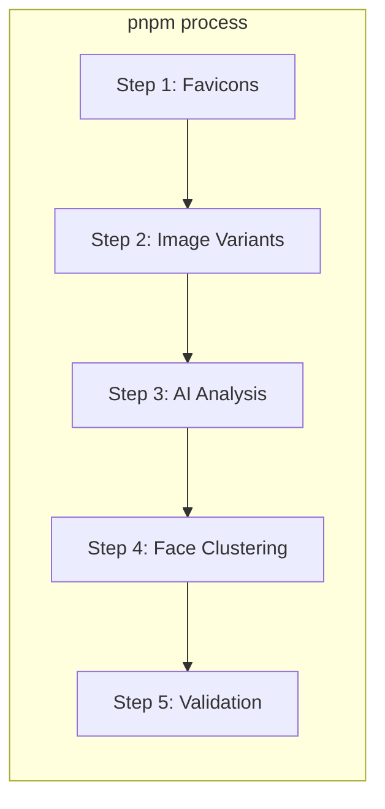
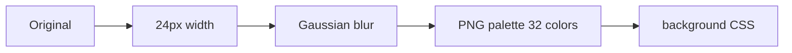
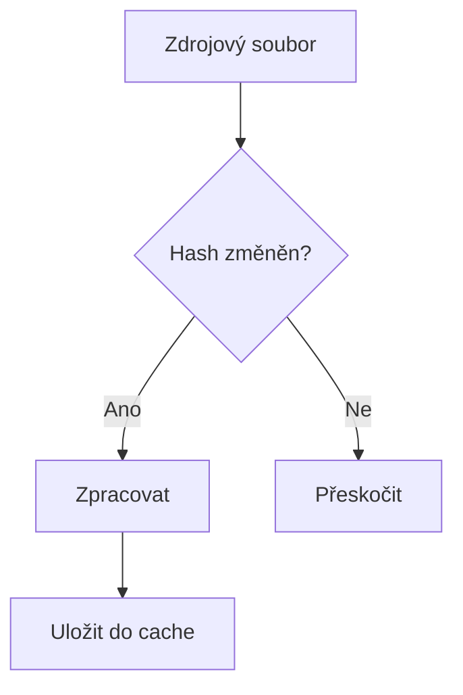

# Build proces

> Skripty, image pipeline a build workflow.

## Obsah

1. [Pipeline přehled](#1-pipeline-přehled)
2. [Image processing](#2-image-processing)
3. [Build kroky](#3-build-kroky)
4. [Optimalizace](#4-optimalizace)

## 1. Pipeline přehled



### Příkazy

| Příkaz         | Účel                          |
| -------------- | ----------------------------- |
| `pnpm process` | Kompletní pipeline            |
| `pnpm dev`     | Dev server (`--manifestOnly`) |
| `pnpm build`   | Production build              |

## 2. Image processing

### Varianty

| Varianta      | Rozměr        | Použití             |
| ------------- | ------------- | ------------------- |
| `default`     | 370×208 crop  | Grid mobile/desktop |
| `xl`          | 534×300 crop  | Grid tablet         |
| `detail`      | 1280px width  | Lightbox            |
| `pano_detail` | 1280px height | Panoramata          |
| `fallback`    | 190×107 crop  | Miniatura           |
| `placeholder` | 24px blur     | LQIP                |

### Formáty

| Formát | Komprese            | Podpora            |
| ------ | ------------------- | ------------------ |
| AVIF   | ~50% menší než JPEG | Moderní prohlížeče |
| WebP   | ~30% menší než JPEG | Široká podpora     |
| JPEG   | Baseline            | Fallback           |

## 3. Build kroky

### Step 1: Favicons

```
Vstup:  content/<gallery>/favicons-source.png
Výstup: static/<gallery>/assets/favicons/
```

### Step 2: Image Variants

```
Vstup:  content/<gallery>/pics/*.{jpg,heic,png}
Výstup: static/<gallery>/images/
```

**Zpracování:**

1. Resize → varianty
2. Encode → AVIF/WebP/JPEG
3. LQIP → 24px blur
4. EXIF → metadata extraction (Pure Wall Clock, bez offsetu)
5. Face detection → bounding boxy (pro smart crop)

### Step 3: AI Analysis

```
Vstup:  Detail JPEG varianty
Výstup: analysis.manifest.json, embeddings.manifest.json
```

**Zpracování:**

1. CLIP embeddings (768D vektory)
2. Aesthetic score
3. Quality bucket (excellent/good/poor)
4. Detekce duplikátů

### Step 4: Face Clustering

```
Vstup:  Detail JPEG varianty
Výstup: people.manifest.json, faces.manifest.json
```

**Zpracování:**

1. Face detection (face-api.js)
2. 128D face embeddings
3. Euclidean distance clustering
4. Face crops → `static/<gallery>/faces/`

### Step 5: Validation

- Odstranění ghost záznamů
- Cleanup orphaned assets
- Vyčištění manifestů

## 4. Optimalizace

### LQIP (Low-Quality Image Placeholder)



### Sharp nastavení

```typescript
{
  palette: true,
  colors: 32,
  quality: 50,
  compressionLevel: 9
}
```

### Cache



## Související dokumenty

- [ARCHITECTURE.md](./ARCHITECTURE.md) — Hlavní přehled
- [SCRIPTS.md](./SCRIPTS.md) — CLI reference
- [ARCH-DATA-FLOW.md](./ARCH-DATA-FLOW.md) — Datové toky

---

_Poslední aktualizace: 2026-01-03_
