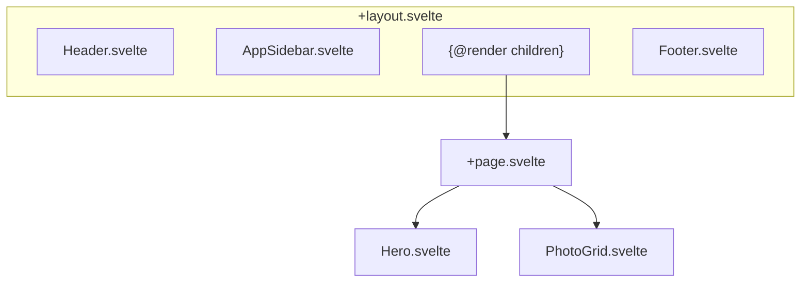

# GUI komponenty

> Přehled Svelte komponent v aplikaci.

## Obsah

1. [Layout](#1-layout)
2. [Hlavní komponenty](#2-hlavní-komponenty)
3. [Sidebar](#3-sidebar)
4. [UI knihovna](#4-ui-knihovna)

## 1. Layout

### Struktura stránky



## 2. Hlavní komponenty

### Hero.svelte

**Cesta:** `src/lib/components/Hero.svelte`

Úvodní sekce s názvem a popisem galerie.

| Breakpoint      | Zarovnání |
| --------------- | --------- |
| Mobile          | Center    |
| Desktop (`lg:`) | Left      |

### PhotoGrid.svelte

**Cesta:** `src/lib/components/PhotoGrid.svelte`

Masonry grid s fotografiemi a separátory.

**Props:**

```typescript
let { items } = $props<{
  items: (ImageEntry | Separator)[];
}>();
```

**Struktura:**

```svelte
{#each items as item}
  {#if item.type === "image"}
    <PhotoGridItem {item} />
  {:else}
    <SeparatorCard {item} />
  {/if}
{/each}
```

### PhotoGridItem.svelte

**Cesta:** `src/lib/components/PhotoGridItem.svelte`

Jednotlivá fotka v gridu.

**Funkce:**

- `<picture>` element s AVIF/WebP/JPEG sources
- Placeholder color před načtením
- Lazy loading (`loading="lazy"`)
- Kontextové menu (pravý klik)
- Fancybox integrace

## 3. Sidebar

### AppSidebar.svelte

**Cesta:** `src/lib/components/AppSidebar.svelte`

Postranní panel s záložkami.

### Záložky

| Záložka | Komponenta          | Účel                       |
| ------- | ------------------- | -------------------------- |
| Agenda  | `AgendaTab.svelte`  | Navigace po dnech/místech  |
| Filtry  | `FiltersTab.svelte` | Filtrování fotografií      |
| Lidé    | `PeopleTab.svelte`  | Správa osob                |
| Editace | `EditTab.svelte`    | Hromadné úpravy (Dev only) |

### AgendaTab.svelte

- Rychlá navigace na dny/místa
- Zvýrazňuje aktivní sekci (Scrollspy)

### PeopleTab.svelte

- Seznam detekovaných osob
- Filtrace podle osob
- Sloučení / skrytí osob
- Sekce: Osoby, Sochy, Malby, Skryté, Junk

## 4. UI knihovna

**Základ:** [shadcn-svelte](https://www.shadcn-svelte.com/) (bits-ui)

### Komponenty

```
src/lib/components/ui/
├── button/
├── card/
├── dialog/
├── dropdown-menu/
├── input/
├── sheet/
├── sidebar/
├── tabs/
└── tooltip/
```

### Použití

```svelte
<script>
  import * as Dialog from "$lib/components/ui/dialog";
</script>

<Dialog.Root>
  <Dialog.Trigger>Otevřít</Dialog.Trigger>
  <Dialog.Content>
    <Dialog.Title>Název</Dialog.Title>
    <!-- obsah -->
  </Dialog.Content>
</Dialog.Root>
```

## Související dokumenty

- [ARCHITECTURE.md](./ARCHITECTURE.md) — Hlavní přehled
- [ARCH-FEATURES.md](./ARCH-FEATURES.md) — Features
- [INTERACTIVITY.md](./INTERACTIVITY.md) — UI interakce

---

_Poslední aktualizace: 2025-12-30_
