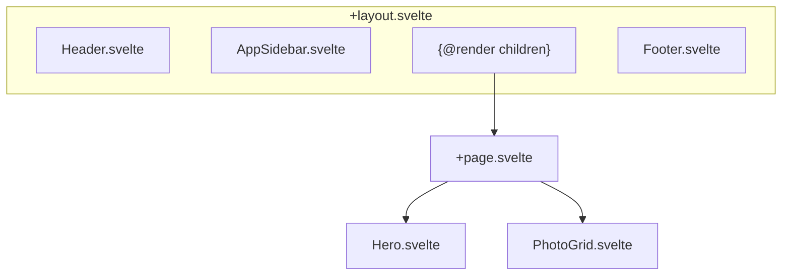

# GUI komponenty

> Přehled Svelte komponent v aplikaci.

**Navigace:** [← INDEX](./INDEX.md) | [ARCHITECTURE →](./ARCHITECTURE.md) | [ARCH-FEATURES →](./ARCH-FEATURES.md)

## Obsah

1. [Layout](#1-layout)
2. [Hlavní komponenty](#2-hlavní-komponenty)
3. [Sidebar](#3-sidebar)
4. [UI knihovna](#4-ui-knihovna)

## 1. Layout

### Struktura stránky



## 2. Hlavní komponenty

### Hero.svelte

**Cesta:** `src/lib/components/Hero.svelte`

Úvodní sekce s názvem a popisem galerie.

| Breakpoint      | Zarovnání |
| --------------- | --------- |
| Mobile          | Center    |
| Desktop (`lg:`) | Left      |

### PhotoGrid.svelte

**Cesta:** `src/lib/components/PhotoGrid.svelte`

Masonry grid s fotografiemi a separátory.

**Props:**

```typescript
let { items } = $props<{
  items: (ImageEntry | Separator)[];
}>();
```

**Struktura:**

```svelte
{#each items as item}
  {#if item.type === "image"}
    <PhotoGridItem {item} />
  {:else}
    <SeparatorCard {item} />
  {/if}
{/each}
```

### PhotoGridItem.svelte

**Cesta:** `src/lib/components/PhotoGridItem.svelte`

Jednotlivá fotka v gridu.

**Funkce:**

- `<picture>` element s AVIF/WebP/JPEG sources
- Placeholder color před načtením
- Lazy loading (`loading="lazy"`)
- Kontextové menu (pravý klik)
- Sequence/collage badgy

### Dialogové komponenty

**Administrační dialogy:**

- `ArchiveImageDialog.svelte` — Archivace fotografie
- `DeleteImageDialog.svelte` — Mazání fotografie
- `MetadataPasteDialog.svelte` — Vkládání metadat
- `PersonDetailDialog.svelte` — Detail osoby
- `PersonMergeDialog.svelte` — Sloučení osob
- `CurationGroupDialog.svelte` — Srovnání duplicit

### Speciální komponenty

- `SequencePlayer.svelte` — Přehrávač sekvencí
- `CurationGroup.svelte` — Skupina podobných fotek
- `SelectionBulkActions.svelte` — Hromadné akce s výběrem
- `GalleryEmptyState.svelte` — Prázdný stav galerie
- `AspectRatioIcon.svelte` — Ikona poměru stran
- Fancybox integrace

## 3. Sidebar

### AppSidebar.svelte

**Cesta:** `src/lib/components/AppSidebar.svelte`

Postranní panel s záložkami.

### Záložky

| Záložka | Komponenta          | Účel                       |
| ------- | ------------------- | -------------------------- |
| Agenda  | `AgendaTab.svelte`  | Navigace po dnech/místech  |
| Filtry  | `FiltersTab.svelte` | Filtrování fotografií      |
| Lidé    | `PeopleTab.svelte`  | Správa osob                |
| Editace | `EditTab.svelte`    | Hromadné úpravy (Dev only) |

### Komponenty v záložkách

**FiltersTab.svelte:**

- Statistiky (fotky, autoři, zastávky)
- Přepínače zobrazení (popisky, zastávky)
- Filtry autorů s počty
- Filtry typu média (4 typy)
- Accordion s Momentkami (3 přepínače) a Kvalitou (3 buckety)
- Přepínač vzhledu (Light/Dark/System)

**AgendaTab.svelte:**

- Rychlá navigace na dny/místa
- Zvýrazňuje aktivní sekci (Scrollspy)

**PeopleTab.svelte:**

- Seznam detekovaných osob
- Filtrace podle osob
- Sloučení / skrytí osob
- Kategorie: `CategoryPersonCard` komponenta
- `PeopleSelectionControls` — ovládání výběru
- `VisiblePeopleList` — seznam viditelných osob
- `HiddenPersonActions` — akce pro skryté osoby

**EditTab.svelte:**

- Multi-výběr fotek
- `SelectedImagesBadges` — vizualizace výběru
- Bulk operace (Archive, Delete, Metadata)
- `MetadataInputField` — vstupní pole pro metadata
- `GeoDataSection` — sekce s GPS daty
- Typ fotky dropdown (Běžná / Momentka autora / Momentka ostatních)

## 4. UI knihovna

Projekt používá **bits-ui** (headless komponenty) + vlastní styled wrapper komponenty v `src/lib/components/ui/`:

### Dostupné komponenty

- `accordion/` — Rozbalovací sekce
- `alert/` — Upozornění a notifikace
- `badge/` — Štítky a označení
- `breadcrumb/` — Navigační drobečková navigace
- `button/` + `button-group/` — Tlačítka
- `card/` — Kartičky
- `checkbox/` — Zaškrtávací políčka
- `context-menu/` — Kontextové menu
- `dialog/` — Modální dialogy
- `dropdown-menu/` — Rozbalovací menu
- `empty/` — Prázdný stav
- `form/` — Formulářové prvky
- `input/` + `textarea/` — Textové vstupy
- `item/` — Generický list item
- `label/` — Popisky
- `navigation-menu/` — Navigační menu
- `separator/` — Oddělovač
- `sheet/` — Boční panel
- `sidebar/` — Sidebary (bits-ui komponenty)
- `skeleton/` — Načítací placeholder
- `sonner/` — Toast notifikace (svelte-sonner)
- `spinner/` — Načítací indikátor
- `switch/` — Přepínač
- `tabs/` — Záložky
- `toggle/` + `toggle-group/` — Toggle tlačítka
- `tooltip/` — Nápovědy

### Design system

- **Tailwind CSS v4** pro styling
- **Tailwind Merge** pro merge classnames
- **Tailwind Variants** pro varianty komponent
- **tw-animate-css** pro animace

### Použití

```svelte
<script>
  import * as Dialog from "$lib/components/ui/dialog";
</script>

<Dialog.Root>
  <Dialog.Trigger>Otevřít</Dialog.Trigger>
  <Dialog.Content>
    <Dialog.Title>Název</Dialog.Title>
    <!-- obsah -->
  </Dialog.Content>
</Dialog.Root>
```

## Související dokumenty

- [ARCHITECTURE.md](./ARCHITECTURE.md) — Hlavní přehled
- [ARCH-FEATURES.md](./ARCH-FEATURES.md) — Features
- [INTERACTIVITY.md](./INTERACTIVITY.md) — UI interakce

---

_Poslední aktualizace: 2026-01-05_
