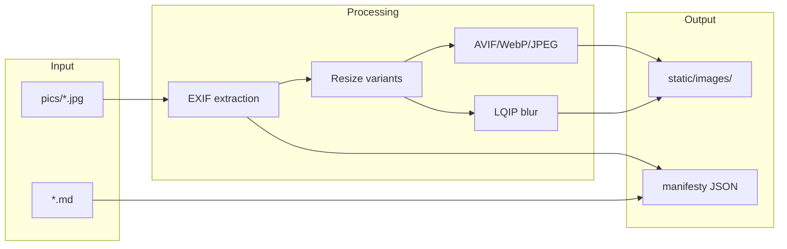
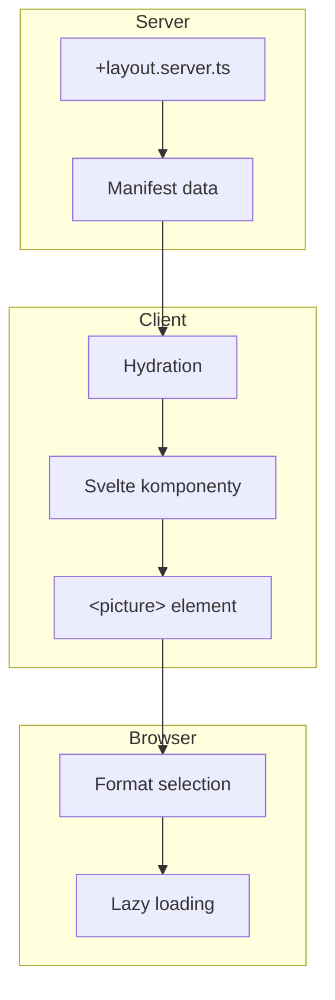
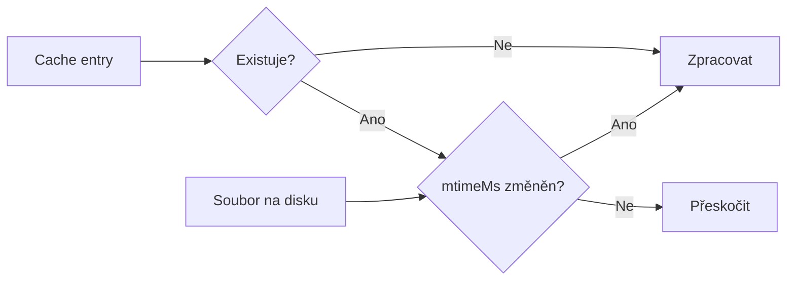

# Datové toky

> Jak data prochází systémem od obsahu po výstup.

## Obsah

1. [Build-time flow](#1-build-time-flow)
2. [Runtime flow](#2-runtime-flow)
3. [Manifesty](#3-manifesty)
4. [Cache systém](#4-cache-systém)

## 1. Build-time flow



### Kroky zpracování

1. **Načtení** → JPEG/PNG/HEIC z `content/<gallery>/pics/`
2. **EXIF** → Extrakce data, GPS, autora
3. **Varianty** → `default` (370px), `xl` (534px), `detail` (1280px)
4. **Formáty** → AVIF, WebP, JPEG fallback
5. **LQIP** → 24px blur placeholder
6. **Manifest** → JSON pro runtime

## 2. Runtime flow



### Image loading

1. Browser parsuje `<picture>` srcset
2. Vybere formát: AVIF > WebP > JPEG
3. Vybere velikost podle viewport
4. Zobrazí placeholder color
5. Lazy load obrázku
6. Nahradí placeholder

## 3. Manifesty

### Split & Link architektura

Metadata rozdělena pro optimalizaci:

| Manifest                   | Obsah                            | Aktualizace         |
| -------------------------- | -------------------------------- | ------------------- |
| `images.manifest.json`     | Struktura, EXIF, sources         | Image processing    |
| `analysis.manifest.json`   | Sharpness, pHash, aestheticScore | AI analýza          |
| `faces.manifest.json`      | Bounding boxy, peopleIds         | Face detection      |
| `embeddings.manifest.json` | CLIP vektory (768D)              | Similarity analysis |
| `people.manifest.json`     | Shlukované osoby                 | Face clustering     |
| `menu.manifest.json`       | Navigační struktura              | Build               |
| `site.manifest.json`       | Konfigurace galerie              | Build               |

### Merge při runtime

```typescript
// +layout.server.ts
const images = await import("$manifests/images.manifest.json");
const analysis = await import("$manifests/analysis.manifest.json");

// Merge by imageId
for (const entry of images.entries) {
  entry.analysis = analysis[entry.id];
}
```

## 4. Cache systém

### Struktura

```
.temp/<gallery>/
└── images.cache.json     # Hash-based build cache
```

### Cache entry

```typescript
type CacheEntry = {
  hash: string; // SHA1 hash obsahu
  mtimeMs: number; // Čas modifikace
  outputs: string[]; // Vygenerované varianty
};
```

### Invalidace

Cache se invaliduje při:

| Podmínka              | Důvod                    |
| --------------------- | ------------------------ |
| Změna `CACHE_VERSION` | Nová verze generátoru    |
| Změna `configHash`    | Změna build konfigurace  |
| Změna `mtimeMs`       | Změna zdrojového souboru |

### Detekce změn



## Související dokumenty

- [ARCHITECTURE.md](./ARCHITECTURE.md) — Hlavní přehled
- [ARCH-BUILD.md](./ARCH-BUILD.md) — Build proces
- [SCRIPTS.md](./SCRIPTS.md) — CLI příkazy

---

_Poslední aktualizace: 2025-12-30_
