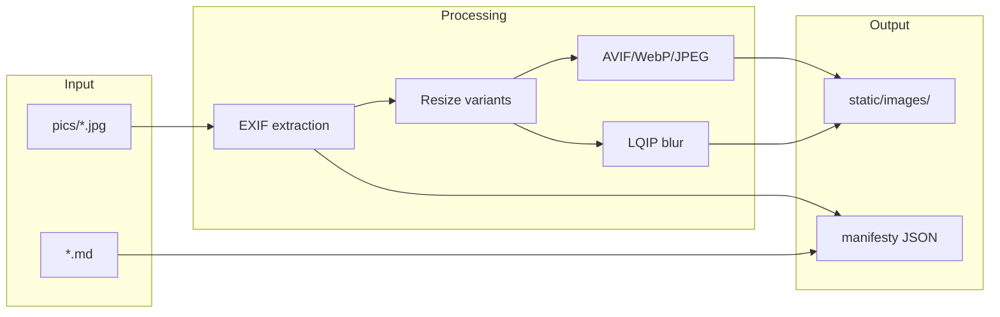
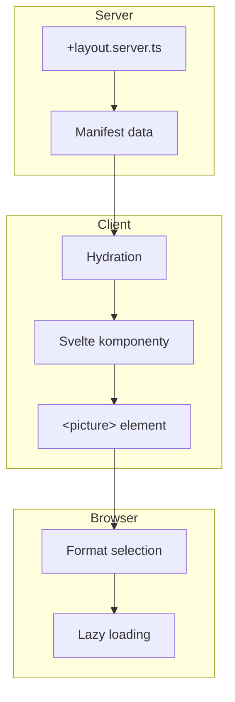
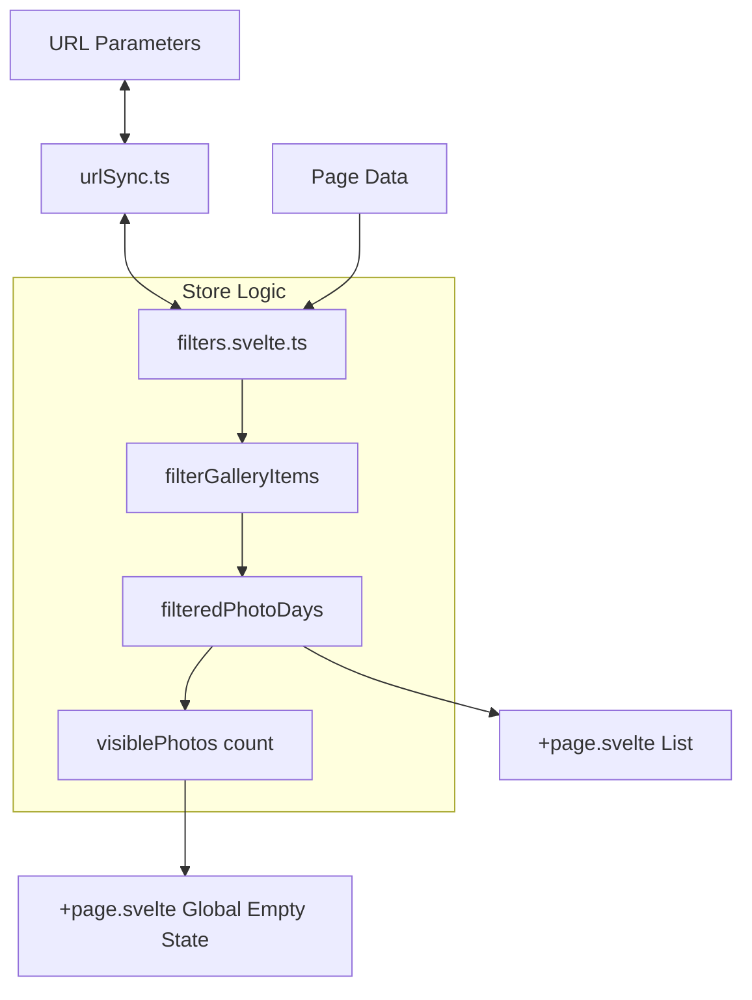
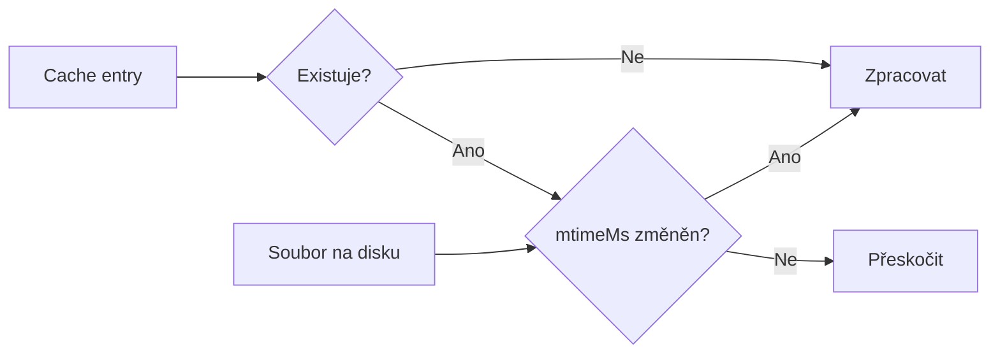

# Datové toky

> Jak data prochází systémem od obsahu po výstup.

**Navigace:** [← INDEX](./INDEX.md) | [ARCHITECTURE →](./ARCHITECTURE.md) | [ARCH-BUILD →](./ARCH-BUILD.md)

## Obsah

1. [Build-time flow](#1-build-time-flow)
2. [Runtime flow](#2-runtime-flow)
3. [Manifesty](#3-manifesty)
4. [Cache systém](#4-cache-systém)

## 1. Build-time flow



### Kroky zpracování

1. **Načtení** → JPEG/PNG/HEIC z `content/<gallery>/pics/`
2. **EXIF** → Extrakce data, GPS, autora
3. **Varianty** → `default` (370px), `xl` (534px), `detail` (1280px)
4. **Formáty** → AVIF, WebP, JPEG fallback
5. **LQIP** → 24px blur placeholder
6. **Manifest** → JSON pro runtime

## 2. Runtime flow



### Image loading

1. Browser parsuje `<picture>` srcset
2. Vybere formát: AVIF > WebP > JPEG
3. Vybere velikost podle viewport
4. Zobrazí placeholder color
5. Lazy load obrázku
6. Nahradí placeholder

### 2.1. Client-Side Data Flow (Filtering)

> **Architektonická změna (Dec 2025):** Všechna logika filtrování je centralizovaná v `filters` store. `+page.svelte` již neprovádí žádné filtrování, pouze konzumuje výsledky.



1. **Load:** Data z `+page.server.ts` jsou nalita do `filters.sourceData`.
2. **Sync:** `urlSync.ts` inicializuje store podle URL.
3. **Compute:** Store reaktivně přepočítá `filteredPhotoDays`.
4. **Render:** `+page.svelte` zobrazí fotky nebo globální Empty State (pokud `visiblePhotos === 0`).

## 3. Manifesty

### Split & Link architektura

Metadata rozdělena pro optimalizaci:

| Manifest                   | Obsah                            | Aktualizace         |
| -------------------------- | -------------------------------- | ------------------- |
| `images.manifest.json`     | Struktura, EXIF, sources         | Image processing    |
| `analysis.manifest.json`   | Sharpness, pHash, aestheticScore | AI analýza          |
| `faces.manifest.json`      | Bounding boxy, peopleIds         | Face detection      |
| `embeddings.manifest.json` | CLIP vektory (768D)              | Similarity analysis |
| `people.manifest.json`     | Shlukované osoby                 | Face clustering     |
| `menu.manifest.json`       | Navigační struktura              | Build               |
| `site.manifest.json`       | Konfigurace galerie              | Build               |

> ⚠️ **Date & Time Policy:** Všechny časové údaje v manifestech jsou ukládány jako "Pure Wall Clock" ISO řetězce (bez offsetu). Viz [ARCHITECTURE.md > Zpracování času](./ARCHITECTURE.md#4-zpracování-času-date--time-policy).

### ImageEntry struktura

Klíčové vlastnosti **ImageEntry** typu:

```typescript
type ImageEntry = {
  id: string;
  type: MediaItemType; // "image" | "sequence" | "sequence-member" | "panorama" | "collage" | "video" | "youtube"
  src: string;

  // Metadata
  author?: string;
  location?: string;
  city?: string;
  latitude?: number;
  longitude?: number;

  // EXIF data (REQUIRED)
  exif: {
    date: string; // Original EXIF time (Wall Clock)
    releaseDate: string; // Sorting time (XMP:ReleaseDate persistent)
    location?: string;
    city?: string;
    latitude?: number;
    longitude?: number;
    orientation?: number; // EXIF rotation (1-8)
  };

  /** User-defined flags */
  flags?: string[]; // ["snapshot-author", "snapshot-others", "favorite", "archived"]

  /** Special categories */
  category?: string; // "collage-source" (auto-hidden in UI)

  /** Sequence information (zoom, pan, timelapse, focus-stack, panorama) */
  sequenceInfo?: {
    representativeId: string; // ID of representative
    memberIds: string[]; // Other members
    type: "zoom" | "pan" | "timelapse" | "focus-stack" | "panorama";
    description?: string;
  };

  /** CLAP (Clean Aperture) metadata from HEIC/HEIF */
  clap?: {
    width: number; // Visible width in pixels
    height: number; // Visible height in pixels
    horizOffset: number; // Horizontal offset (px)
    vertOffset: number; // Vertical offset (px)
  };

  // Other metadata
  sources?: ImageSource[]; // For collages (source images)
  people?: string[];
  analysis?: {
    qualityBucket?: QualityBucket; // "excellent" | "good" | "poor"
    sharpness: number;
    phash: string;
    aestheticScore?: number;
  };
};
```

**Special properties:**

- **`exif.date`** — Original EXIF time (Wall Clock string, never Date object)
- **`exif.releaseDate`** — Persistent sorting time (XMP:ReleaseDate in file)
- **`flags`** — User-defined filtering flags
  - `"snapshot-author"` — Private snapshot (no documentary value)
  - `"snapshot-others"` — Snapshot from others
  - `"favorite"`, `"archived"` — Custom markers
- **`category`** — Special categories
  - `"collage-source"` — Source image for collage (auto-hidden)
- **`sequenceInfo`** — For grouped shots (zoom sequences, burst, timelapse, etc.)
- **`clap`** — HEIC/HEIF Clean Aperture crop data (from native HEIC atom)

### Separator struktura

```typescript
type Separator = {
  type: "separator";
  id: string; // Format: loc-{slugLocation}{-timeSuffix}
  location: string; // Key from markdown, maps to EXIF location
  city: string;
  storyTitle?: string; // From markdown frontmatter
  story?: string; // HTML (parsed via marked.js)
  startDate?: string; // Wall Clock time
  endDate?: string; // Wall Clock time
  hasPhotos?: boolean; // Calculated during build
};
```

**Properties:**

- **Markdown-driven:** Defined in `content/<gallery>/locations/*.md`
- **Auto-generated:** For photo groups without markdown (if `>= minPhotosForAutoSeparator`)
- **Multiple visits:** `visits[]` in markdown → Multiple separators same day
- **Story rendering:** Markdown → HTML (via marked.js parser)

### PhotoDay struktura

```typescript
type PhotoDay = {
  date: string; // YYYY-MM-DD (Wall Clock)
  id: string;
  items: (ImageEntry | Separator)[]; // Mixed sequence
  cities?: string[];
  locations?: string[];
  story?: string; // Day-level story
  mergedDates?: string[]; // If multiple days merged
};
```

**Critical: Sequence members in PhotoDay:**

All sequence members are placed in the representative's PhotoDay, **even if they have EXIF times on other days** (midnight crossings):

```
Example:
- Member 1: 2025-11-25T23:50:00 (Egypt TZ)
- Member 2: 2025-11-25T23:55:00
- Member 3: 2025-11-26T00:05:00 ← Crosses midnight!
- Representative: 2025-11-25T23:52:00

Result: All members → PhotoDay 2025-11-25 (representative's)
```

### Merge při runtime

```typescript
// +layout.server.ts
const images = await import("$manifests/images.manifest.json");
const analysis = await import("$manifests/analysis.manifest.json");

// Merge by imageId
for (const entry of images.entries) {
  entry.analysis = analysis[entry.id];
}
```

## 4. Cache systém

### Struktura

```
.temp/<gallery>/
└── images.cache.json     # Hash-based build cache
```

### Cache entry

```typescript
type CacheEntry = {
  hash: string; // SHA1 hash obsahu
  mtimeMs: number; // Čas modifikace
  outputs: string[]; // Vygenerované varianty
};
```

### Invalidace

Cache se invaliduje při:

| Podmínka              | Důvod                    |
| --------------------- | ------------------------ |
| Změna `CACHE_VERSION` | Nová verze generátoru    |
| Změna `configHash`    | Změna build konfigurace  |
| Změna `mtimeMs`       | Změna zdrojového souboru |

### Detekce změn



### 4.1. API Consistency (Dev Mode)

V development módu (`bun run dev`) běží server v dlouhodobém procesu s in-memory cache pro manifesty. API endpointy, které modifikují data na disku (např. `api/people/merge`, `api/images/collage`), musí explicitně invalidovat tuto cache.

**Mechanismus:**

1. API provede změnu na disku (např. `fs.writeFile`).
2. API zavolá `await reloadManifests()` (z `$lib/utils/images`).
3. Server znovu načte JSON soubory do paměti.
4. UI zavolá `invalidateAll()`, což triggeruje `load` funkce, které nyní dostanou čerstvá data.

## Související dokumenty

- [ARCHITECTURE.md](./ARCHITECTURE.md) — Hlavní přehled
- [ARCH-BUILD.md](./ARCH-BUILD.md) — Build proces
- [SCRIPTS.md](./SCRIPTS.md) — CLI příkazy

---

_Poslední aktualizace: 2026-01-05_
