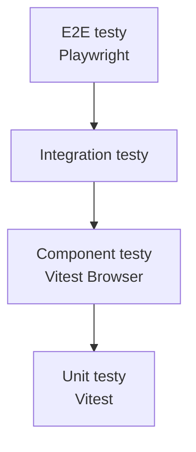

# Development workflow

> Vývoj, závislosti a testování.

## Obsah

1. [Požadavky](#1-požadavky)
2. [Příkazy](#2-příkazy)
3. [Workflow](#3-workflow)
4. [Testování](#4-testování)

## 1. Požadavky

### Systémové

| Nástroj | Verze  | Instalace (macOS)   |
| ------- | ------ | ------------------- |
| Node.js | ≥24    | `brew install node` |
| Bun     | latest | `brew install bun`  |
| libvips | –      | `brew install vips` |

### Doporučené VS Code rozšíření

- **Svelte for VS Code** (`svelte.svelte-vscode`)
- **Biome** (`biomejs.biome`)
- **Prettier** (`esbenp.prettier-vscode`)

## 2. Příkazy

### Development

```bash
# Interaktivní výběr galerie
pnpm dev

# Konkrétní galerie
pnpm dev -- -g egypt-2025
```

### Code quality

```bash
pnpm format      # Formátování (Biome + Prettier)
pnpm lint        # Linting (Biome + Stylelint)
pnpm check       # TypeScript + Svelte check
pnpm check:watch # Watch mode
```

### Testing

```bash
pnpm test        # Všechny testy
pnpm test:unit   # Unit testy
pnpm test:e2e    # E2E testy (Playwright)
```

### Build

```bash
pnpm process     # Kompletní pipeline (images + AI + faces)
pnpm build       # Production build
```

## 3. Workflow

### Přidání fotek


### Před commitem

```bash
pnpm format && pnpm check && pnpm test:unit
```

### Před PR

```bash
pnpm format && pnpm check && pnpm test
```

## 4. Testování

### Pyramida testů



### Struktura

```
tests/
├── unit/           # Rychlé unit testy
│   ├── core/       # Doménová logika
│   ├── stores/     # Svelte stores
│   └── features/   # Utilities
├── components/     # Vitest Browser Mode
├── integration/    # API + ScrollSpy
└── e2e/            # Playwright
```

### Spouštění

| Příkaz                         | Projekt             | Environment |
| ------------------------------ | ------------------- | ----------- |
| `pnpm test:unit`               | unit-core, unit-dom | Node.js     |
| `pnpm vitest --project client` | client              | Browser     |
| `pnpm test:e2e`                | –                   | Playwright  |

### Vitest Browser Mode

Component testy vyžadují `CONTENT_DIR`:

```bash
CONTENT_DIR=egypt-2025 pnpm vitest run --project client
```

## Související dokumenty

- [ARCHITECTURE.md](./ARCHITECTURE.md) — Hlavní přehled
- [TESTING.md](./TESTING.md) — Detailní testovací strategie
- [CODE-QUALITY.md](./CODE-QUALITY.md) — QA nástroje
- [SCRIPTS.md](./SCRIPTS.md) — CLI reference

---

_Poslední aktualizace: 2025-12-30_
