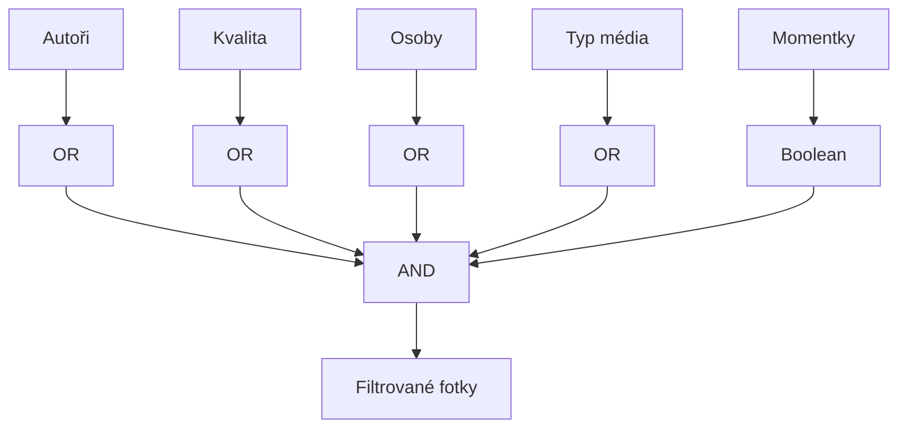

# Features

> Klíčové funkce implementované v projektu.

## Obsah

1. [Routing](#1-routing)
2. [Stores](#2-stores)
3. [Filtrace](#3-filtrace)
4. [Editační režim](#4-editační-režim)
5. [Kurátorský režim](#5-kurátorský-režim)

## 1. Routing

### SvelteKit file-based routing

```
src/routes/
├── +layout.server.ts   # Načítá manifesty
├── +layout.svelte      # Header + Sidebar + Footer
├── +page.svelte        # Homepage (PhotoGrid)
└── api/
    ├── geocode/        # Reverzní geocoding
    ├── images/         # Image operations
    └── people/         # Person management
```

### Data loading

```mermaid
flowchart LR
    SERVER[+layout.server.ts] --> LOAD[load()]
    LOAD --> MANIFEST[Manifesty]
    MANIFEST --> PROPS[PageData]
    PROPS --> COMPONENT[+page.svelte]
```

## 2. Stores

Svelte 5 runes-based stores:

| Store                  | Účel                                      |
| ---------------------- | ----------------------------------------- |
| `filters.ts`           | SSoT pro filtrovaná data a aktivní filtry |
| `curation.ts`          | Kurátorský workflow                       |
| `editorState.ts`       | Multi-výběr, editační stav                |
| `urlSync.ts`           | Synchronizace s URL parametry             |
| `metadataClipboard.ts` | Kopírování/vkládání metadat               |
| `uiState.ts`           | Viditelnost UI prvků                      |
| `scrollspy.ts`         | Detekce aktivní sekce                     |

### Pattern

```typescript
// Class-based pattern
export class FilterStore {
  authors = $state(new Set<string>());
  quality = $state(new Set<string>());

  toggleAuthor(id: string) {
    /* ... */
  }
}

export const filters = new FilterStore();
```

## 3. Filtrace

### Filtrační logika



| Filtr     | Vztah   | Popis                                      |
| --------- | ------- | ------------------------------------------ |
| Autoři    | OR      | Alespoň jeden vybraný                      |
| Kvalita   | OR      | Excellent / Good / Poor (prázdné = vše)    |
| Osoby     | OR      | Alespoň jedna vybraná                      |
| Typ média | OR      | Foto / Panorama / Sekvence (prázdné = vše) |
| Momentky  | Boolean | Zobrazit/skrýt cizí momentky               |
| Průnik    | AND     | Kombinace všech filtrů                     |

### Empty State

### Empty State

**Globální úroveň (+page.svelte):**
Pokud filtry vyřadí všechny fotografie (`visiblePhotos === 0`), aplikace skryje celou strukturu galerie (včetně hlaviček dnů a zastávek) a zobrazí centrální **GalleryEmptyState** komponentu. To zabraňuje zobrazení "prázdných nadpisů".

**Reset:**
Tlačítko "Zrušit aktivní filtry" resetuje pouze omezující kritéria (autory, kvalitu...), ale zachovává uživatelské nastavení zobrazení (zastávky, popisky).

### URL synchronizace

```

```

/?authors=cebreus,jana&quality=excellent,good&people=alice&media=panorama&no-others-snapshots

````

Synchronizace je **obousměrná** a **debouncovaná** (50ms):
1. Změna ve Store -> `urlSync.ts` -> `goto(?params)`
2. Změna URL (back/forward) -> `urlSync.ts` -> Update Store


## 4. Editační režim

**Aktivace:** Záložka „Editace" v sidebaru (pouze Dev Mode)

### Akce

| Akce          | Popis                   |
| ------------- | ----------------------- |
| Klik na fotku | Přidat/odebrat z výběru |
| Shift + Klik  | Hromadný výběr rozsahu  |
| Pravý klik    | Kontextové menu         |

### Kontextové menu

- **Smazat / Archivovat** → Odstranění z galerie
- **Kopírovat metadata** → Do schránky aplikace
- **Vložit metadata** → Na vybrané fotky

## 5. Kurátorský režim

**Aktivace:** Ikona „Jiskry" v hlavičce (pouze Dev Mode)

### Detekce duplikátů

```mermaid
flowchart LR
    PHASH[pHash podobnost] --> GROUP[Skupina]
    TIME[Časové okno 4h] --> GROUP
    GROUP --> BEST[Doporučeno]
    GROUP --> REST[Ostatní]
````

### Indikátory

| Vizuál              | Význam                    |
| ------------------- | ------------------------- |
| Jantarový okraj     | Fotka má duplikát         |
| Štítek „DOPORUČENO" | Nejlepší kandidát v sérii |
| Tlačítko „Porovnat" | Otevře srovnávací dialog  |

### Kritéria doporučení

1. Rozlišení (vyšší = lepší)
2. Aesthetic score (AI hodnocení)
3. Sharpness (ostrost)

## Související dokumenty

- [ARCHITECTURE.md](./ARCHITECTURE.md) — Hlavní přehled
- [INTERACTIVITY.md](./INTERACTIVITY.md) — UI interakce
- [ARCH-COMPONENTS.md](./ARCH-COMPONENTS.md) — GUI komponenty

---

_Poslední aktualizace: 2025-12-31_
