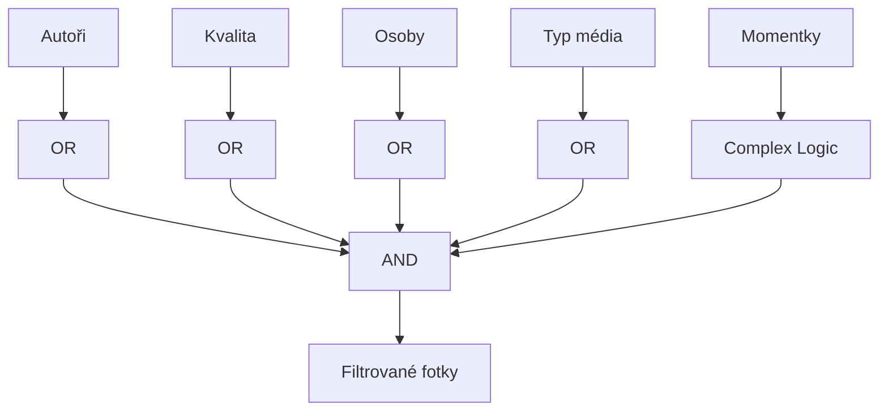
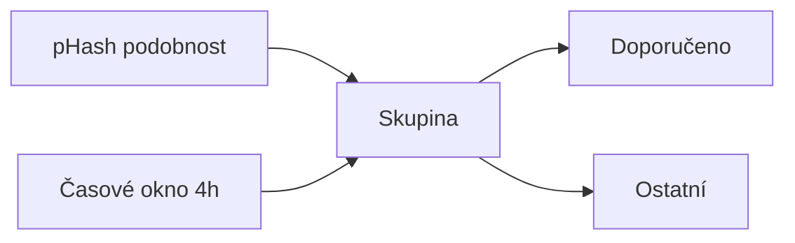

# Features

> Klíčové funkce implementované v projektu.

**Navigace:** [← INDEX](./INDEX.md) | [ARCHITECTURE →](./ARCHITECTURE.md) | [ARCH-COMPONENTS →](./ARCH-COMPONENTS.md)

## Obsah

1. [Routing](#1-routing)
2. [Stores](#2-stores)
3. [Filtrace](#3-filtrace)
4. [Separátory](#4-separátory)
5. [Sekvence (Sequences)](#5-sekvence-sequences)
6. [Řazení (ReleaseDate)](#6-řazení-releasedate)
7. [Editační režim](#7-editační-režim)
8. [CLAP (Clean Aperture)](#8-clap-clean-aperture)
9. [Kurátorský režim](#9-kurátorský-režim)

## 1. Routing

### SvelteKit file-based routing

```
src/routes/
├── +layout.server.ts   # Načítá manifesty
├── +layout.svelte      # Header + Sidebar + Footer
├── +page.svelte        # Homepage (PhotoGrid)
└── api/
    ├── geocode/        # Reverzní geocoding
    ├── images/         # Image operations
    └── people/         # Person management
```

### Data loading

```mermaid
flowchart LR
    SERVER[+layout.server.ts] --> LOAD[load()]
    LOAD --> MANIFEST[Manifesty]
    MANIFEST --> PROPS[PageData]
    PROPS --> COMPONENT[+page.svelte]
```

## 2. Stores

Svelte 5 runes-based stores: **Detailní dokumentace viz [STORES.md](./STORES.md)**

| Store                      | Účel                                      |
| -------------------------- | ----------------------------------------- |
| `filters.svelte.ts`        | SSoT pro filtrovaná data a aktivní filtry |
| `manifest.svelte.ts`       | Centrální manifest store (PhotoDay[])     |
| `selectedImages.svelte.ts` | Multi-výběr fotek                         |
| `editingMode.svelte.ts`    | Editační stav a aktuální editor           |

### Pattern (aktualizováno 2026)

```typescript
// Module-level state (Svelte 5 runes)
let selectedAuthors = $state<string[]>([]);
let selectedPeople = $state<string[]>([]);
let showSeparators = $state(true);

// Derived examples
const filterCount = $derived(selectedAuthors.length + selectedPeople.length);

// Public API via exported singleton object (getters/setters)
export const filters = {
  get selectedAuthors() {
    return selectedAuthors;
  },
  set selectedAuthors(v: string[]) {
    selectedAuthors = v;
  },

  get selectedPeople() {
    return selectedPeople;
  },
  set selectedPeople(v: string[]) {
    selectedPeople = v;
  },

  get showSeparators() {
    return showSeparators;
  },
  set showSeparators(v: boolean) {
    showSeparators = v;
  },

  get filterCount() {
    return filterCount;
  },

  reset() {
    selectedAuthors = [];
    selectedPeople = [];
    showSeparators = true;
  },
};
```

**Key:** Runes na úrovni modulu + exportovaný objekt s getters/setters (namísto `writable` store).

---

_Poslední aktualizace: 2026-01-06_

## 3. Filtrace

### Dostupné filtry

| Filtr                 | Typ     | Popis                                              |
| --------------------- | ------- | -------------------------------------------------- |
| **Autoři**            | OR      | Výběr fotografů (výchozí: všichni)                 |
| **Typ média**         | OR      | Fotografie / Panoramata / Sekvence / Koláže        |
| **Momentky**          | Complex | 3 režimy: Pouze momentky / Momentky autora / Další |
| **Kvalita fotek**     | OR      | Excelentní / Dobré / Podprůměrné (AI + ostrost)    |
| **Osoby**             | OR      | Filtr podle detekovaných osob                      |
| **Zobrazit popisky**  | Boolean | Popisky u fotek                                    |
| **Zobrazit zastávky** | Boolean | Separátory mezi zastávkami                         |

### Filtrační logika



### Speciální filtry

#### Momentky (Snapshots)

3 nezávislé přepínače:

1. **Pouze momentky** (`onlySnapshots`) — Zobrazí POUZE momentky, skryje běžné fotky
2. **Zobrazit momentky autora** (`showAuthorSnapshots`) — Zapnuto = viditelné, vypnuto = skryté
3. **Zobrazit další momentky** (`showOthersSnapshots`) — Zapnuto = viditelné, vypnuto = skryté

**Flagy v manifestu:**

- `snapshot-author` — Soukromé snímky autora (bez dokumentární hodnoty)
- `snapshot-others` — Momentky od ostatních osob

#### Kategorie (skryté)

- `collage-source` — Zdrojové obrázky použité pro koláže (automaticky skryté)
- Sekvenční členy (nereprezentativní framy) — skryté, zobrazuje se pouze reprezentativní snímek

## 4. Separátory

**Poznámka:** Separátory jsou dynamicky generované prvky oddělující fotky podle místa/času.

### Zdroje separátorů

1. **Markdown-driven** — Definované v `content/<gallery>/locations/*.md`
2. **Auto-generated** — Vytvořeny pro skupiny fotek bez markdown (dle `minPhotosForAutoSeparator`)

### Markdown struktura

```yaml
---
title: Nazareth
location: Nazareth
city: Izrael
startDate: 2022-10-20T09:00:00
endDate: 2022-10-20T12:00:00
visits:
  - startDate: 2025-11-25T08:00:00
    endDate: 2025-11-25T09:00:00
  - startDate: 2025-11-25T18:00:00
    endDate: 2025-11-25T20:00:00
---
# Obsah příběhu v markdown
```

**Klíčové vlastnosti:**

- `location` — Identifikátor pro spojení s fotkami (EXIF location field)
- `startDate` / `endDate` — Čas separátoru v galerii
- `visits` — Více navštívení stejného místa v jeden den
- Markdown obsah → HTML (`marked.js` parser) → Uloženo v manifestu

### Zobrazení

| Podmínka                             | Výsledek                           |
| ------------------------------------ | ---------------------------------- |
| S fotkami + s příběhem               | Modal dialog se příběhem           |
| S fotkami + bez příběhu              | Gradient header bez dialogu        |
| Bez fotek (orphan)                   | Skrytý v galerii, viditelný v menu |
| Méně fotek než `minPhotosForDisplay` | Skrytý (nastavitelné)              |

### Konfigurace (build.config.ts)

```typescript
separator: {
  minPhotosForAutoSeparator: 3,  // Pro auto-generování
  minPhotosForDisplay: 3,        // Pro zobrazení v gridu
}
```

### ID generování

```typescript
// Format: loc-{slugLocation}{-timeSuffix}
"loc-nazareth"; // Simple
"loc-hotel-0800"; // Multiple visits same day
"loc-hotel-1800"; // (time suffix: -HHMM)
```

---

## 5. Sekvence (Sequences)

**Princip:** Fotografie pořízené v krátké posloupnosti (zoom, pan, timelapse, focus-stack) jsou seskupeny pod jeden reprezentativní snímek.

### Detekce

```
10-minute time window
        ↓
Automatické seskupení
        ↓
Výběr reprezentanta (nejostřejší nebo pers)
        ↓
Ostatní členy: skryté, přístupné v SequencePlayer
```

**Detekčních kritéria:**

- Stejné `location` EXIF pole
- Časy v rozmezí 10 minut od sebe
- Typ: zoom, pan, timelapse, focus-stack, panorama

### Struktura manifestu

```typescript
type ImageEntry = {
  id: string;
  type: "sequence" | "sequence-member" | "panorama" | ...;

  sequenceInfo?: {
    representativeId: string;  // ID reprezentanta
    memberIds: string[];        // Ostatní členy
    type: "zoom" | "pan" | "timelapse" | "focus-stack" | "panorama";
    description?: string;       // "10 snímků zoom" apod.
  };
};
```

### Day grouping s sekvencemi

**KRITICKÉ:** Všichni členové sekvence jsou **silně umisťováni do reprezentantova PhotoDay**, i když mají EXIF časy na jiných dnech.

```
Sekvence člen 1: 2025-11-25T23:50:00 (Egypt TZ)
Sekvence člen 2: 2025-11-25T23:55:00
Sekvence člen 3: 2025-11-26T00:05:00 ← Přechod přes půlnoc!
Reprezentant:    2025-11-25T23:52:00

Výsledek: Všichni → PhotoDay 2025-11-25 (reprezentanta)
```

**ReleaseDate inheritance:** Když změníte `releaseDate` reprezentanta, všichni členové dědí stejnou hodnotu.

### UI komponenta

```svelte
<SequencePlayer {sequence} {variant} />
```

Umožňuje procházení members, přepínání reprezentanta apod.

---

## 6. Řazení (ReleaseDate)

**⚠️ KRITICKÁ ZMĚNA:** Migrace z `sortOrder.manifest.json` na XMP:ReleaseDate metadata.

### Historické řešení (DEPRECATED)

```json
// Stará: sortorder.manifest.json
{
  "IMG_1234": 0,
  "IMG_5678": 1
}
```

**Problémy:**

- Nepersistentní (pouze v jednom souboru)
- Při přenosu fotek se ztratilo
- Nelze migrovat bez manifestu

### Nový systém (CURRENT)

```
Uživatel draguje fotku v grid
        ↓
API: POST /api/images/reorder
        ↓
Kalkulace releaseDate (Time Slot Swapping algoritmus)
        ↓
ExifTool zapisuje do souboru (XMP:ReleaseDate)
        ↓
Trvale v HEIC/JPEG metadatech
        ↓
Manifest: exif.releaseDate
```

**Příklad:**

```typescript
// API payload
{
  dayId: "d1",
  moves: [
    { imageId: "IMG_001", targetIndex: 0 },
    { imageId: "IMG_002", targetIndex: 1 },
  ]
}

// Odpověď
{
  success: true,
  relocations: {
    "IMG_001": {
      oldReleaseDate: "2022-10-20T10:00:00",
      newReleaseDate: "2022-10-20T09:58:00"
    }
  }
}
```

### Time Slot Swapping

Algoritmus zajišťuje:

1. **Seřazení** — Fotky setřídí se v pořadí od nejstarších k nejnovějším
2. **Slotování** — Přiřadí časové sloty (interval mezi fotkami)
3. **Konflikt resolution** — Pokud jsou fotky ve stejném slotu, adjustuje o 1 sekundu

### Priorita řazení

```
Reprezentant sekvence
    ↓ (priorita)
Běžné fotky
    ↓
Sekvence členy (nemajetní v UI, ale viditelní v Player)
```

---

## 7. Editační režim

**Aktivace:** Záložka „Editace" v sidebaru (pouze Dev Mode)

### Akce

| Akce          | Popis                   |
| ------------- | ----------------------- |
| Klik na fotku | Přidat/odebrat z výběru |
| Shift + Klik  | Hromadný výběr rozsahu  |
| Pravý klik    | Kontextové menu         |

### Kontextové menu (na separátoru)

- **Distribuovat rovnoměrně** — Rozprostře fotky rovnoměrně v čase separátoru
- **Obnovit** — Vrátí fotky na původní časy

### Kontextové menu (na fotce)

- **Smazat / Archivovat** → Odstranění z galerie
- **Kopírovat metadata** → Do schránky aplikace
- **Vložit metadata** → Na vybrané fotky
- **Swap časy** — Prohodit časy s jinou fotkou

---

## 8. CLAP (Clean Aperture)

**Princip:** HEIC/HEIF fotografie mohou obsahovat CLAP atom (Clean Aperture) — instrukci jak ořezat "surový" snímek na užitečnou část.

### Zdroj dat

```
HEIC fotografický soubor (native resolution: 3000×2000)
    ↓
CLAP atom (instrukce: ořez na 2500×1800 viditelné části)
    ↓
ExifTool parser → CleanApertureData
    ↓
GUI editor → UserCrop (po rotaci)
    ↓
ExifTool writer (persistuje do HEIC)
```

### Souřadnicové systémy

```
Native (nativní snímač, bez rotace):
┌─────────────────┐
│ 3000×2000       │
│ CLAP atom zde   │
└─────────────────┘

User-space (po aplikaci EXIF Orientation):
┌────────┐
│ 2000×3000 (otočeno) │
│ Editor UI   │
└────────┘
```

### EditTab CLAP integracija

```svelte
<ClapEditor image={currentImage} onCropChange={(crop) => saveClapMetadata(crop)} />
```

### API: POST /api/images/clap-preview

```typescript
// Náhled CLAP ořezu
{
  imageId: "IMG_1234",
  clap: { width: 2500, height: 1800, ... },
  variant: "detail"
}
```

---

## 9. Kurátorský režim

**Aktivace:** Ikona „Jiskry" v hlavičce (pouze Dev Mode)

### Detekce duplikátů



### Indikátory

| Vizuál              | Význam                    |
| ------------------- | ------------------------- |
| Jantarový okraj     | Fotka má duplikát         |
| Štítek „DOPORUČENO" | Nejlepší kandidát v sérii |
| Tlačítko „Porovnat" | Otevře srovnávací dialog  |

### Kritéria doporučení

1. Rozlišení (vyšší = lepší)
2. Aesthetic score (AI hodnocení)
3. Sharpness (ostrost)

## Související dokumenty

- [ARCHITECTURE.md](./ARCHITECTURE.md) — Hlavní přehled
- [INTERACTIVITY.md](./INTERACTIVITY.md) — UI interakce
- [ARCH-COMPONENTS.md](./ARCH-COMPONENTS.md) — GUI komponenty

---

_Poslední aktualizace: 2026-01-05_
