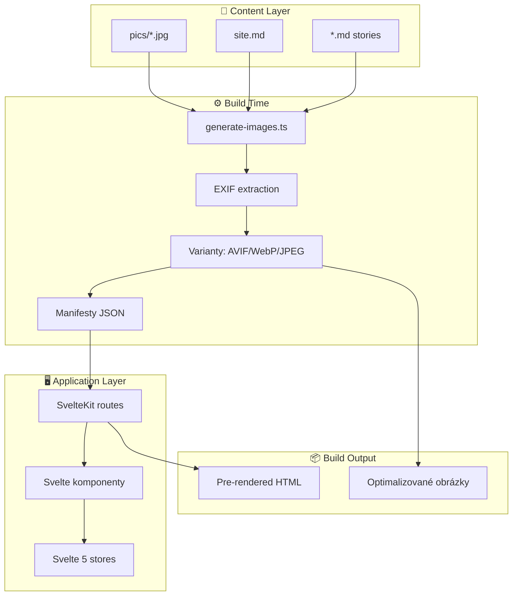

# Architektura projektu

> Multi-gallery fotoblog postavený na SvelteKit 5 + Bun runtime.

**Navigace:** [← INDEX](./INDEX.md) | [ARCH-STRUCTURE →](./ARCH-STRUCTURE.md) | [ARCH-CONFIG →](./ARCH-CONFIG.md)

## Obsah

1. [Přehled](#1-přehled)
2. [Technologický stack](#2-technologický-stack)
3. [Architektura systému](#3-architektura-systému)
4. [Zpracování času](#4-zpracování-času-date--time-policy)
5. [Související dokumenty](#5-související-dokumenty)

## 1. Přehled

**Klíčový koncept:** Proměnná `CONTENT_DIR` řídí aktivní galerii → jedna kódová základna, více nezávislých galerií.

### Hlavní architektury

| Subsystém      | Klíč                                      |
| -------------- | ----------------------------------------- |
| **Separátory** | Markdown-driven s auto-generováním        |
| **Sekvence**   | 10-min detection window, day-grouping     |
| **Řazení**     | XMP:ReleaseDate persistent (ne sortorder) |
| **CLAP**       | HEIC/HEIF native crop metadata            |
| **Kolláže**    | Detekce `--collage` suffixu, media type   |
| **Filtrace**   | 7 filtrů + momentky (snapshot flags)      |

### Charakteristiky

| Vlastnost        | Popis                                              |
| ---------------- | -------------------------------------------------- |
| Multi-gallery    | `israel-2022`, `egypt-2025` … řízeno `CONTENT_DIR` |
| Image processing | Sharp → AVIF/WebP/JPEG varianty, LQIP placeholders |
| Static export    | Pre-rendered SSG, optimální SEO                    |
| Type-safe        | Kompletní TypeScript pokrytí                       |
| Time as string   | Wall Clock (nikdy Date object) — bez timezone      |

## 2. Technologický stack

### Runtime & Build

| Nástroj                                   | Verze  | Účel                      |
| ----------------------------------------- | ------ | ------------------------- |
| [Bun](https://bun.sh/)                    | latest | Runtime + package manager |
| [SvelteKit](https://kit.svelte.dev/)      | 2.49+  | Framework                 |
| [Vite](https://vitejs.dev/)               | 7.3+   | Build tool                |
| [Sharp](https://sharp.pixelplumbing.com/) | 0.34+  | Image processing          |

### Frontend

- **Svelte 5** (5.46+, runes API)
- **Tailwind CSS v4** (4.1+, `@tailwindcss/vite`)
- **bits-ui** (2.14+, headless komponenty)
- **Fancybox** (6.1+, lightbox)

### Testing

- **Vitest** (4.0+) — Unit + Integration
- **Playwright** (1.57+) — E2E
- **Biome** (2.3+) — Linting/Formatting
- **Prettier** (3.7+) — Markdown/Svelte formatting

## 3. Architektura systému



### Split & Link manifesty

Metadata jsou rozdělena pro optimalizaci:

| Manifest                   | Obsah                            |
| -------------------------- | -------------------------------- |
| `images.manifest.json`     | Struktura, EXIF, sources         |
| `analysis.manifest.json`   | Sharpness, pHash, aestheticScore |
| `faces.manifest.json`      | Detekce tváří, peopleIds         |
| `embeddings.manifest.json` | CLIP vektory (768D)              |
| `people.manifest.json`     | Shlukované osoby                 |

## 4. Zpracování času: "Wall Clock" politika

> **⚠️ KRITICKÁ DESIGN DECISION — Neměňte bez konzultace!**

### Proč ne Date objekty?

```javascript
// ❌ PROBLÉM: Časová zóna je závisová na systému
new Date("2025-11-25T09:16:00");
// Na systému s UTC+1: 2025-11-25T08:16:00 UTC
// Na systému s UTC+0: 2025-11-25T09:16:00 UTC
// → Výsledek je nepředviditelný!

// ✅ ŘEŠENÍ: Práce jen s ISO stringy
"2025-11-25T09:16:00" < "2025-11-25T09:28:00";
// Funguje správně bez ohledu na timezone
```

### Zdrojové časy (Immutable)

```
HEIC fotografický soubor
    ↓
ExifTool extrahuje raw čas → "2025:11:25 09:28:36"
    ↓
metadata.ts konvertuje → "2025-11-25T09:28:36" (BEZ ZMĚNY hodin/minut)
    ↓
exif.date v manifestu ← Wall Clock čas z fotoaparátu
```

### Řazovací časy (Mutable)

```
Uživatel draguje fotku v gridu
    ↓
API: POST /api/images/reorder
    ↓
Time Slot Swapping algoritmus
    ↓
ExifTool zapisuje → XMP:ReleaseDate "2025-11-25T09:58:00"
    ↓
exif.releaseDate v manifestu ← Nový čas (persistent v HEIC)
```

### Data storage

| Pole               | Typ    | Příklad               | Mutabilní? | Perzistentní? |
| ------------------ | ------ | --------------------- | ---------- | ------------- |
| `exif.date`        | string | "2025-11-25T09:28:00" | ❌ Nikdy   | ✅ HEIC       |
| `exif.releaseDate` | string | "2025-11-25T09:58:00" | ✅ API     | ✅ HEIC       |
| `date` (root)      | string | "2025-11-25T..."      | Deprecated | —             |

### Komparování (Sorting)

```typescript
// Všechny časy jsou stringy ISO 8601 → lexicographic porovnání funguje!
const times = ["2025-11-25T09:58:00", "2025-11-25T10:05:00", "2025-11-25T10:00:00"];

times.sort();
// Výsledek: správné!
// ["2025-11-25T09:58:00", "2025-11-25T10:00:00", "2025-11-25T10:05:00"]
```

(Date & Time Policy)

**Breaking Change (Jan 2026):** Projekt přešel na striktní **"True Wall Clock"** princip.

- **Koncept**: Čas pořízení fotky je považován za neměnný řetězec, nezávislý na časovém pásmu diváka nebo serveru.
- **Implementace**:
  - ❌ **Zákaz `Date` objektů**: Pro parsování a formátování časů zobrazení se nesmí používat `new Date()`, protože vnáší offset prohlížeče.
  - ✅ **String-only**: Všechny časy jsou v celém systému (build, manifest, frontend) předávány jako ISO řetězce bez offsetu (např. `2025-11-25T08:30:00`).
  - **Důvod**: Eliminace posunů času (např. fotka vyfocená v 09:00 v Egyptě se nesmí v ČR zobrazit jako 08:00).
- **Nástroje**:
  - `shared/utils/dates.ts` → `toPureWallClockISO`, `formatWallClock`
  - Manifesty obsahují pouze "ořezané" časy bez `Z` nebo offsetu `+XX:XX`.

## 5. Související dokumenty

- [ARCH-STRUCTURE.md](./ARCH-STRUCTURE.md) — Adresářová struktura projektu
- [ARCH-CONFIG.md](./ARCH-CONFIG.md) — Konfigurační soubory (Vite, TS, Tailwind…)

### Datové toky

- [ARCH-DATA-FLOW.md](./ARCH-DATA-FLOW.md) — Manifesty, cache, runtime flow

### Implementace

- [ARCH-FEATURES.md](./ARCH-FEATURES.md) — Routing, stores, features
- [ARCH-COMPONENTS.md](./ARCH-COMPONENTS.md) — GUI komponenty (Svelte)

### Build & Deploy

- [ARCH-BUILD.md](./ARCH-BUILD.md) — Skripty, image pipeline, build proces
- [ARCH-DEPLOY.md](./ARCH-DEPLOY.md) — Deployment, CI/CD

### Development

- [ARCH-DEV.md](./ARCH-DEV.md) — Workflow, závislosti, testing

### Funkce

- [COLLAGE-EDITOR.md](./COLLAGE-EDITOR.md) — Editor koláží
- [PERSON-MANAGEMENT.md](./PERSON-MANAGEMENT.md) — Správa osob
- [SPECIAL-MEDIA.md](./SPECIAL-MEDIA.md) — Panoramata, sekvence, 360°
- [FACE-CLUSTERING.md](./FACE-CLUSTERING.md) — Detekce a shlukování tváří

---

_Poslední aktualizace: 2026-01-05_
