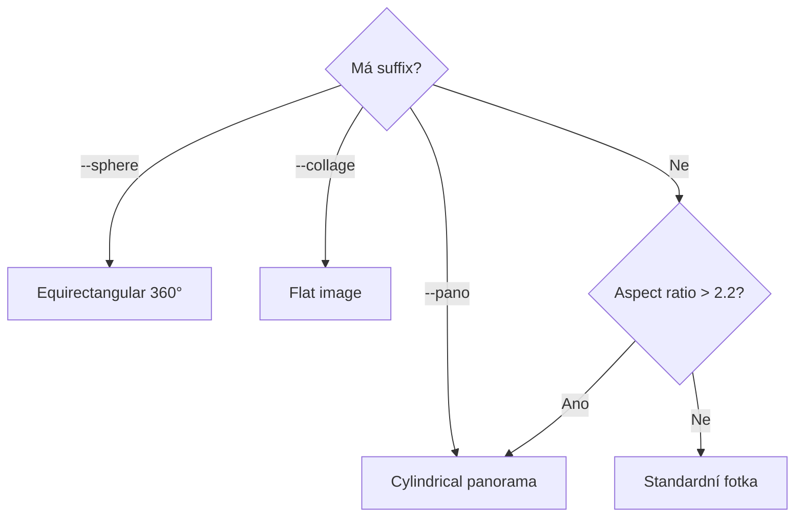
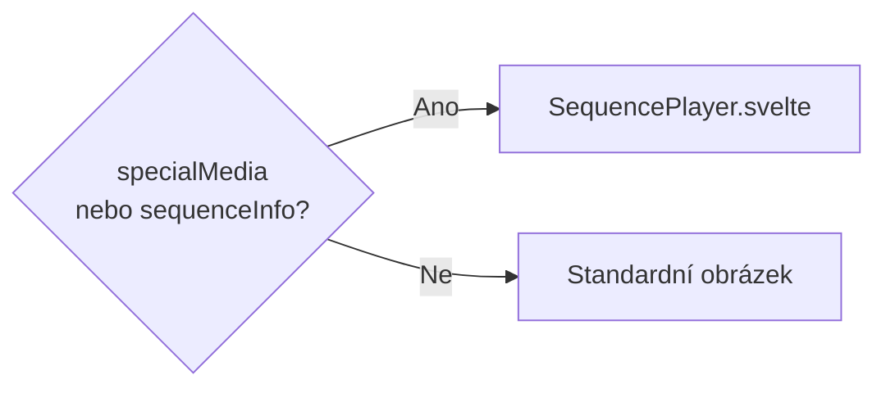

# Speciální média

> Podpora panoramat, sekvencí a 360° fotografií.

## Obsah

1. [Podporované typy](#1-podporované-typy)
2. [Detekce](#2-detekce)
3. [Architektura](#3-architektura)

## 1. Podporované typy

### Sekvence

| Suffix          | Typ         | Popis                | Interval |
| --------------- | ----------- | -------------------- | -------- |
| `--zoomXfromY`  | Zoom        | Crossfade zoom efekt | 2000ms   |
| `--panXfromY`   | Pan         | Panoramatický pohyb  | 600ms    |
| `--burstXfromY` | Burst       | Rychlá sekvence      | 300ms    |
| `--tlXfromY`    | Timelapse   | Časosběr             | 100ms    |
| `--focusXfromY` | Focus-Stack | Hloubka ostrosti     | 500ms    |

### Jednosouborová média

| Suffix      | Typ        | Popis                    |
| ----------- | ---------- | ------------------------ |
| `--pano`    | Panorama   | Horizontální scrollování |
| `--sphere`  | 360° sféra | Equirectangular projekce |
| `--collage` | Koláž      | Flat image (bez vieweru) |

## 2. Detekce

### Priorita



### Konvence pojmenování

```
YYYY-MM-DD-HHMMSS-autor--[typ][index]from[total].ext
YYYY-MM-DD-HHMMSS-autor--pano.ext
YYYY-MM-DD-HHMMSS-autor--sphere.ext
```

## 3. Architektura

### Typy v manifestu

```typescript
// shared/types/manifest.ts
type SpecialMediaData = {
  isPanorama?: boolean;
  is360?: boolean;
  projection?: "cylindrical" | "equirectangular" | "flat";
};

type SequenceInfo = {
  type: SequenceType;
  index: number;
  total: number;
  members?: string[];
};
```

### Build pipeline

| Modul                  | Funkce                                                |
| ---------------------- | ----------------------------------------------------- |
| `metadata.ts`          | `detectSpecialMedia()` → `specialMedia` field         |
| `sequence-detector.ts` | Grupování členů (10min okno) → `sequenceInfo.members` |
| `processor.ts`         | Generuje `pano_detail` variantu pro panoramata        |

### Runtime (Fancybox)



### SequencePlayer

| Režim    | Chování                    |
| -------- | -------------------------- |
| Sekvence | Auto-play s crossfade      |
| Panorama | Horizontální auto-scroll   |
| 360°     | _(TODO: Pannellum viewer)_ |

### Image varianty

| Varianta      | Rozměr        | Použití            |
| ------------- | ------------- | ------------------ |
| `detail`      | 1280px width  | Lightbox, sekvence |
| `pano_detail` | 1280px height | Panoramata         |

## Související dokumenty

- [ARCHITECTURE.md](./ARCHITECTURE.md) — Hlavní přehled
- [ARCH-BUILD.md](./ARCH-BUILD.md) — Build proces
- [COLLAGE-EDITOR.md](./COLLAGE-EDITOR.md) — Editor koláží

---

_Poslední aktualizace: 2026-01-03_
