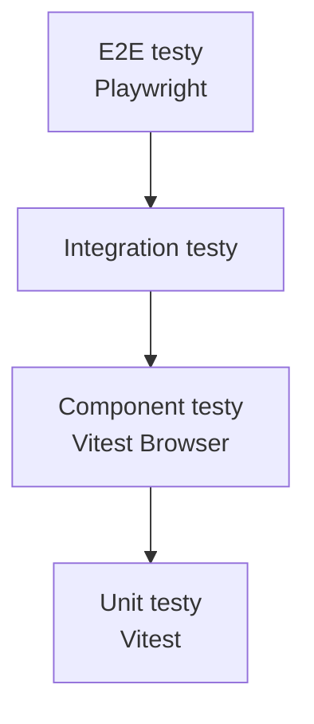

# Testování

> Strategie a průvodce testováním v projektu.

**Navigace:** [← INDEX](./INDEX.md) | [ARCH-DEV →](./ARCH-DEV.md) | [CODE-QUALITY →](./CODE-QUALITY.md)

## Obsah

1. [Přehled](#1-přehled)
2. [Pyramida testů](#2-pyramida-testů)
3. [Spouštění testů](#3-spouštění-testů)
4. [Psaní testů](#4-psaní-testů)
5. [Image pipeline testy](#5-image-pipeline-testy)
6. [Časté problémy](#6-časté-problémy)

## 1. Přehled

Projekt je **multi-gallery fotoblog** běžící na **Bun runtime**.

**Framework:** Vitest (unit/component/integration) + Playwright (E2E)

**Reference:** [`tests/README.md`](../tests/README.md)

## 2. Pyramida testů



| Typ         | Environment     | Rychlost | Použití           |
| ----------- | --------------- | -------- | ----------------- |
| Unit        | Node.js         | <50ms    | Logika, utility   |
| Component   | Browser         | ~500ms   | Svelte komponenty |
| Integration | Node.js/Browser | ~2s      | API, ScrollSpy    |
| E2E         | Playwright      | >2s      | Kritické flow     |

## 3. Spouštění testů

### Základní příkazy

```bash
bun run test              # Všechny testy
bun run test:unit         # Unit testy (unit-core + unit-dom)
bun run test:integration  # Integration testy (API + build + data, s SHARP_NUM_THREADS=1)
bun run test:coverage     # S code coverage reportem
bun run test:e2e          # E2E testy (Playwright)
```

### Projekty Vitest

Vite.config.ts definuje **6 projektů**:

| Projekt                   | Environment | Účel                            |
| ------------------------- | ----------- | ------------------------------- |
| **`client`**              | Browser     | Svelte komponenty (playwright)  |
| **`unit-core`**           | Node.js     | Doménová logika, utilities      |
| **`unit-dom`**            | jsdom       | Stores, features (DOM simulace) |
| **`integration-api`**     | Node.js     | API routes testing              |
| **`integration-build`**   | Node.js     | Build & CLI scripts             |
| **`integration-data`**    | Node.js     | Data integrity & manifests      |
| **`browser-integration`** | Browser     | Complex browser interactions    |

```bash
# Unit testy
bun run test:unit                                   # unit-core + unit-dom
bun vitest run --project unit-core                  # Pouze core logika
bun vitest run --project unit-dom                   # Stores, features

# Integration testy
bun run test:integration                            # API + build + data
bun vitest run --project integration-api            # API routes
bun vitest run --project integration-build          # Build scripts
bun vitest run --project integration-data           # Data processing

# Component testy
bun vitest run --project client                     # Svelte komponenty
bun vitest run --project browser-integration        # Browser interactions

# Všechny
bun run test                                        # Spustí všechny projekty
```

## 4. Psaní testů

### Struktura

```
tests/
├── unit/               # Unit testy
│   ├── core/           # Doménová logika
│   ├── stores/         # Svelte stores
│   └── features/       # Utility
├── components/         # Vitest Browser Mode
├── integration/        # API, ScrollSpy
├── e2e/                # Playwright
└── fixtures/           # Testovací data
```

### Unit test příklad

```typescript
import { describe, expect, it } from "vitest";

import { toSlug } from "$lib/utils/strings";

describe("toSlug", () => {
  it("converts text to slug", () => {
    expect(toSlug("Hello World")).toBe("hello-world");
  });
});
```

### Component test příklad

```typescript
import { describe, expect, it, vi } from "vitest";
import { render } from "vitest-browser-svelte";
import { page } from "vitest/browser";

import AgendaTab from "$lib/components/sidebar-content/AgendaTab.svelte";

describe("AgendaTab", () => {
  it("renders menu items", async () => {
    render(AgendaTab, { props: { menuItems: mockData } });
    await expect.element(page.getByText("24. listopadu")).toBeInTheDocument();
  });
});
```

### E2E test příklad

```typescript
import { expect, test } from "@playwright/test";

test("loads main page", async ({ page }) => {
  await page.goto("/");
  await expect(page).toHaveTitle(/Fotoblog/);
});
```

## 5. Image pipeline testy

### Cíl

Ověřit spolehlivost `scripts/generate-images.ts`:

- CLI přepínače: `--manifestOnly`, `--curation`, `--clean`
- Multi-gallery podpora
- LQIP blur generování
- Hash-based caching
- Determinismus výstupů

### Konfigurace

Testy používají `vitest.config.images.ts`:

- Delší timeouty (60s)
- Sériové spouštění
- `SHARP_NUM_THREADS=1` pro determinismus

### Příkazy

```bash
pnpm test:unit:images    # Unit testy pro image pipeline
pnpm test:images         # Integrační testy
```

### Integrační scénáře

| Scénář                 | Testuje                         |
| ---------------------- | ------------------------------- |
| Main Images Generation | Generování variant, manifesty   |
| Manifest-Only          | `--manifestOnly` flag           |
| Curation Manifest      | `--curation`, detekce duplikátů |
| Blur Assets            | LQIP placeholders               |
| Clean Mode             | `--clean`, odstranění osiřelých |

### Pomocné utility

| Soubor               | Účel                                      |
| -------------------- | ----------------------------------------- |
| `fixtures.ts`        | Programové generování testovacích obrázků |
| `process-helpers.ts` | Spouštění CLI jako child process          |
| `manifest-assert.ts` | Normalizace pro snapshot matching         |

## 6. Časté problémy

### IntersectionObserver is not defined

**Příčina:** jsdom nepodporuje IntersectionObserver

**Řešení:** Mock z `tests/fixtures/observers.ts` nebo Browser Mode

### Chybějící CONTENT_DIR

**Příčina:** Component testy vyžadují manifest data

**Řešení:**

```bash
CONTENT_DIR=egypt-2025 pnpm vitest run --project client
```

### Timeout v Browser Mode

**Příčina:** Async operace nedoběhly

**Řešení:**

```typescript
await new Promise((resolve) => setTimeout(resolve, 200));
```

### vi.mock factory hoisting

**Příčina:** Top-level proměnné v mock factory

**Řešení:** Vytvořte mock objekty přímo v factory funkci

## Best Practices

1. **Testujte chování, ne implementaci**
2. **Preferujte Browser Mode pro UI testy**
3. **Držte testy rychlé** (unit <50ms, component <500ms)
4. **Používejte data-testid** — stabilnější než CSS selektory

## Související dokumenty

- [INDEX.md](./INDEX.md) — Rozcestník dokumentace
- [ARCH-DEV.md](./ARCH-DEV.md) — Development workflow
- [CODE-QUALITY.md](./CODE-QUALITY.md) — QA nástroje
- [SCRIPTS.md](./SCRIPTS.md) — CLI reference

---

_Poslední aktualizace: 2026-01-05_
